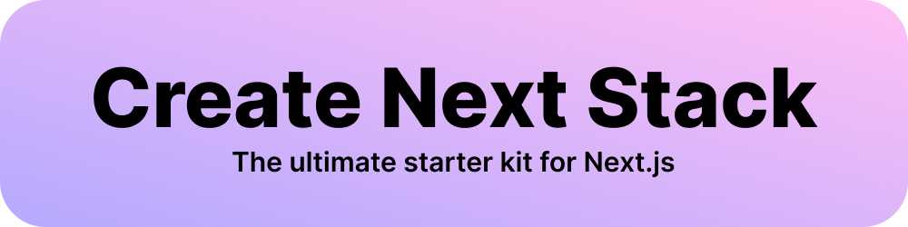

<p align="center">
  <a aria-label="NPM version" href="https://www.npmjs.com/package/create-next-stack">
    
  </a>
  <a aria-label="Build status" href="https://github.com/akd-io/create-next-stack/actions/workflows/main.yml?query=branch%3Adevelop">
    
  </a>
  <a aria-label="Last commit" href="https://github.com/akd-io/create-next-stack/commits/develop">
    
  </a>
  <a aria-label="License" href="https://github.com/akd-io/create-next-stack/blob/develop/LICENSE">
    
  </a>
</p>

Create Next Stack is an opinionated interactive CLI tool to easily set up the boilerplate of a new [Next.js](https://github.com/vercel/next.js) app.

Where [Create Next App](https://github.com/vercel/next.js/tree/canary/packages/create-next-app) lets you choose a single template only, Create Next Stack lets you pick and choose an array of technologies often used alongside Next.js, and free you of the pain of making them work together.

To get started, run:

```bash
npx create-next-stack
```

## Supported technologies

The tables below show the technologies currently supported by Create Next Stack.

### Mandatory technologies

These technologies are currently mandatory. If you don't want to use these technologies, you will have to set up your project manually with Create Next App, or find and use a template repo you can clone here on GitHub.

| Name                                          | Links                                                                                                                                                        |
| --------------------------------------------- | ------------------------------------------------------------------------------------------------------------------------------------------------------------ |
| [Next.js](https://nextjs.org/)                | [Docs](https://nextjs.org/docs) - [Learn Next.js](https://nextjs.org/learn) - [GitHub repo](https://github.com/vercel/next.js)                               |
| [React](https://reactjs.org/)                 | [Docs](https://reactjs.org/docs/getting-started.html) - [GitHub repo](https://github.com/facebook/react)                                                     |
| [TypeScript](https://www.typescriptlang.org/) | [Docs](https://www.typescriptlang.org/docs/) - [GitHub repo](https://github.com/microsoft/TypeScript)                                                        |
| [ESLint](https://eslint.org/)                 | [Configuration](https://eslint.org/docs/user-guide/configuring/) - [Rules](https://eslint.org/docs/rules/) - [GitHub Repo](https://github.com/eslint/eslint) |
| [Yarn](https://yarnpkg.com/)                  | [CLI Docs](https://yarnpkg.com/cli) - [GitHub repo](https://github.com/yarnpkg/berry)                                                                        |

### Optional technologies

These technologies are optional, and can be chosen to fit your needs.

| Name                                                      | Links                                                                                                                                                                |
| --------------------------------------------------------- | -------------------------------------------------------------------------------------------------------------------------------------------------------------------- |
| [Emotion](https://emotion.sh/docs/introduction)           | [Docs](https://emotion.sh/docs/introduction) - [GitHub repo](https://github.com/emotion-js/emotion)                                                                  |
| [CSS Modules](https://github.com/css-modules/css-modules) | [Docs](https://github.com/css-modules/css-modules) - [Next.js-specific docs](https://nextjs.org/docs/basic-features/built-in-css-support#adding-component-level-css) |
| [React Hook Form](https://react-hook-form.com/)           | [Docs](https://react-hook-form.com/get-started) - [GitHub repo](https://github.com/react-hook-form/react-hook-form)                                                  |
| [Formik](https://formik.org/)                             | [Docs](https://formik.org/docs/overview) - [GitHub repo](https://github.com/formium/formik)                                                                          |
| [Framer Motion](https://www.framer.com/motion/)           | [Docs](https://www.framer.com/docs/) - [GitHub repo](https://github.com/framer/motion)                                                                               |
| [Prettier](https://prettier.io/)                          | [Docs](https://prettier.io/docs/en/index.html) - [Options](https://prettier.io/docs/en/options.html) - [GitHub repo](https://github.com/prettier/prettier)           |
| [Husky](https://typicode.github.io/husky/)                | [Docs](https://typicode.github.io/husky/) - [GitHub repo](https://github.com/typicode/husky)                                                                         |
| [lint-staged](https://github.com/okonet/lint-staged)      | [GitHub repo](https://github.com/okonet/lint-staged)                                                                                                                 |

## CLI Options

Below you see an overview of Create Next Stack's CLI options. The overview is the result of running `create-next-stack --help`

```
USAGE
  $ create-next-stack

OPTIONS
  -h, --help     show CLI help
  -v, --version  show CLI version
  --debug        show verbose error messages for debugging purposes
```

## License

Create Next Stack is released under the [MIT License](LICENSE).
