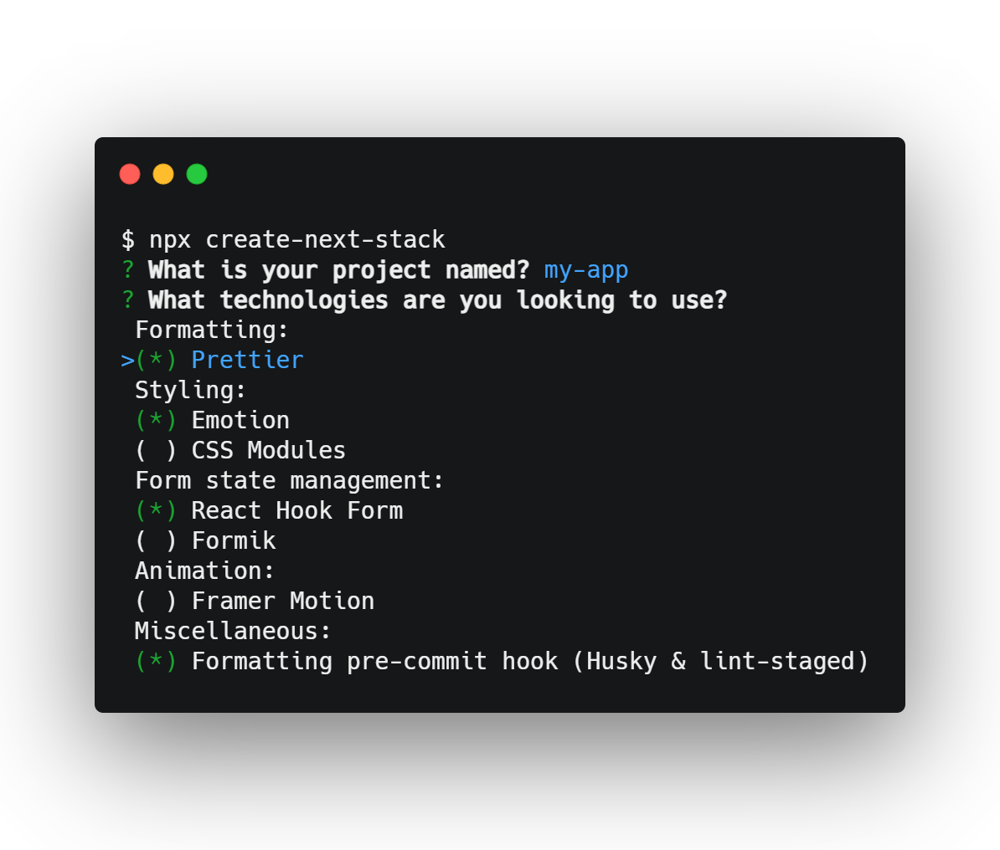

<p align="center">
  <a aria-label="NPM version" href="https://www.npmjs.com/package/create-next-stack">
    
  </a>
  <a aria-label="Build status" href="https://github.com/akd-io/create-next-stack/actions/workflows/main.yml?query=branch%3Adevelop">
    
  </a>
  <a aria-label="Last commit" href="https://github.com/akd-io/create-next-stack/commits/develop">
    
  </a>
  <a aria-label="License" href="https://github.com/akd-io/create-next-stack/blob/develop/LICENSE">
    
  </a>
  <a aria-label="Create Next Stack Website GitHub Repository" href="https://github.com/akd-io/create-next-stack-website">
    
  </a>
  <a aria-label="GitHub Repo stars" href="https://github.com/akd-io/create-next-stack">
    
  </a>
  <a aria-label="Community Discord" href="https://discord.gg/7Ns5WwGjjZ">
    
  </a>
  <a aria-label="Twitter profile of the creator of Create Next Stack" href="https://twitter.com/akd_io">
    
  </a>
</p>

[Create Next Stack](https://www.create-next-stack.com/) is a website and CLI tool used to easily set up the boilerplate of new [Next.js](https://github.com/vercel/next.js) apps.

Where [Create Next App](https://github.com/vercel/next.js/tree/canary/packages/create-next-app) lets you choose a single template only, Create Next Stack lets you pick and choose an array of technologies often used alongside Next.js, and free you of the pain of making them work together.

This repository covers the CLI tool, while [create-next-stack-website](https://github.com/akd-io/create-next-stack-website) covers the site.

To get started, go to [create-next-stack.com](https://www.create-next-stack.com) or run:

```bash
npx create-next-stack
```

If using the CLI, you'll be prompted to pick a project name, and your preferred technologies like so:

<p align="center">
  
</p>

## Supported technologies

The table below provides an overview of the technologies currently supported by Create Next Stack.

### Technologies table

| Name                                                      | Links                                                                                                                                                                |
| --------------------------------------------------------- | -------------------------------------------------------------------------------------------------------------------------------------------------------------------- |
| [Next.js](https://nextjs.org/) ⚠                          | [Docs](https://nextjs.org/docs) - [Learn Next.js](https://nextjs.org/learn) - [GitHub repo](https://github.com/vercel/next.js)                                       |
| [React](https://reactjs.org/) ⚠                           | [Docs](https://reactjs.org/docs/getting-started.html) - [GitHub repo](https://github.com/facebook/react)                                                             |
| [TypeScript](https://www.typescriptlang.org/) ⚠           | [Docs](https://www.typescriptlang.org/docs/) - [GitHub repo](https://github.com/microsoft/TypeScript)                                                                |
| [ESLint](https://eslint.org/) ⚠                           | [Configuration](https://eslint.org/docs/user-guide/configuring/) - [Rules](https://eslint.org/docs/rules/) - [GitHub Repo](https://github.com/eslint/eslint)         |
| [pnpm](https://pnpm.io/)                                  | [Docs](https://pnpm.io/motivation) - [GitHub repo](https://github.com/pnpm/pnpm)                                                                                     |
| [Yarn](https://yarnpkg.com/)                              | [CLI Docs](https://yarnpkg.com/cli) - [GitHub repo](https://github.com/yarnpkg/berry)                                                                                |
| [npm](https://www.npmjs.com/)                             | [CLI Docs](https://docs.npmjs.com/cli/)                                                                                                                              |
| [Emotion](https://emotion.sh/docs/introduction)           | [Docs](https://emotion.sh/docs/introduction) - [GitHub repo](https://github.com/emotion-js/emotion)                                                                  |
| [Styled Components](https://styled-components.com/)       | [Docs](https://styled-components.com/docs) - [GitHub repo](https://github.com/styled-components/styled-components)                                                   |
| [Tailwind CSS](https://tailwindcss.com/)                  | [Docs](https://tailwindcss.com/docs) - [GitHub repo](https://github.com/tailwindlabs/tailwindcss)                                                                    |
| [CSS Modules](https://github.com/css-modules/css-modules) | [Docs](https://github.com/css-modules/css-modules) - [Next.js-specific docs](https://nextjs.org/docs/basic-features/built-in-css-support#adding-component-level-css) |
| [Sass](https://sass-lang.com/)                            | [Docs](https://sass-lang.com/documentation) - [Next.js-specific docs](https://nextjs.org/docs/basic-features/built-in-css-support#sass-support)                      |
| [Chakra UI](https://chakra-ui.com/)                       | [Docs](https://chakra-ui.com/docs/getting-started) - [GitHub repo](https://github.com/chakra-ui/chakra-ui)                                                           |
| [Material UI](https://material-ui.com/)                   | [Docs](https://material-ui.com/getting-started/installation/) - [GitHub repo](https://github.com/mui-org/material-ui)                                                |
| [React Hook Form](https://react-hook-form.com/)           | [Docs](https://react-hook-form.com/get-started) - [GitHub repo](https://github.com/react-hook-form/react-hook-form)                                                  |
| [Formik](https://formik.org/)                             | [Docs](https://formik.org/docs/overview) - [GitHub repo](https://github.com/formium/formik)                                                                          |
| [Framer Motion](https://www.framer.com/motion/)           | [Docs](https://www.framer.com/docs/) - [GitHub repo](https://github.com/framer/motion)                                                                               |
| [Prettier](https://prettier.io/)                          | [Docs](https://prettier.io/docs/en/index.html) - [Options](https://prettier.io/docs/en/options.html) - [GitHub repo](https://github.com/prettier/prettier)           |
| [Husky](https://typicode.github.io/husky/)                | [Docs](https://typicode.github.io/husky/) - [GitHub repo](https://github.com/typicode/husky)                                                                         |
| [lint-staged](https://github.com/okonet/lint-staged)      | [GitHub repo](https://github.com/okonet/lint-staged)                                                                                                                 |
| [GitHub Actions](https://github.com/features/actions)     | [Docs](https://docs.github.com/en/actions) - [Workflow syntax](https://docs.github.com/en/actions/reference/workflow-syntax-for-github-actions)                      |

#### ⚠ Required

Technologies marked with ⚠ are required. If you don't want to use these technologies, you have three options:

1. Set up your project using Create Next Stack anyway, and make the necessary adjustments manually.
1. Set up your project manually with Create Next App.
1. Find and use a template repo you can clone here on GitHub.

## Usage

Below you see an overview of Create Next Stack's usage, including detailed information about arguments and options. The overview is the result of running `create-next-stack --help`

```
USAGE
  $ create-next-stack [APPNAME]

ARGUMENTS
  APPNAME  The name of your app, optionally including a path prefix. Eg.: "my-app" or "path/to/my-app"

OPTIONS
  -h, --help                         Shows the CLI help information.
  -v, --version                      Shows the CLI version information.
  --chakra                           Adds Chakra UI. (Component library) (Requires Emotion and Framer Motion)
  --debug                            Show verbose error messages for debugging purposes.
  --formatting-pre-commit-hook       Adds a formatting pre-commit hook. (Requires Prettier)
  --formik                           Adds Formik. (Form library)
  --framer-motion                    Adds Framer Motion. (Animation library)
  --github-actions                   Adds a GitHub Actions continuous integration workflow.
  --material-ui                      Adds Material UI. (Component library)
  --package-manager=(pnpm|yarn|npm)  Sets the preferred package manager. (Required)
  --prettier                         Adds Prettier. (Code formatting)
  --react-hook-form                  Adds React Hook Form. (Form library)
  --styling=<styling-method>         Sets the preferred styling method. (Required) <styling-method> = emotion|styled-components|tailwind-css|css-modules|css-modules-with-sass
```

## License

Create Next Stack is released under the [MIT License](LICENSE).
